# 02 Process Analysis

In this module, you'll learn how to identify key elements of process analysis:
*flow rates (throughput)*, and *flow times*, how to uncover bottlenecks, how to
optimize labor and *inventory*, and how to handle the complexities of multiple
flow units. 

At the end of this module, you'll be able to break down operations into
*processes* which can then be improved to *maximize profits and efficiency*.

## 02.01 The 3 Measures: Flow Rate, Inventory, and Flow Time

### Subway - Sitting in Front of the Store

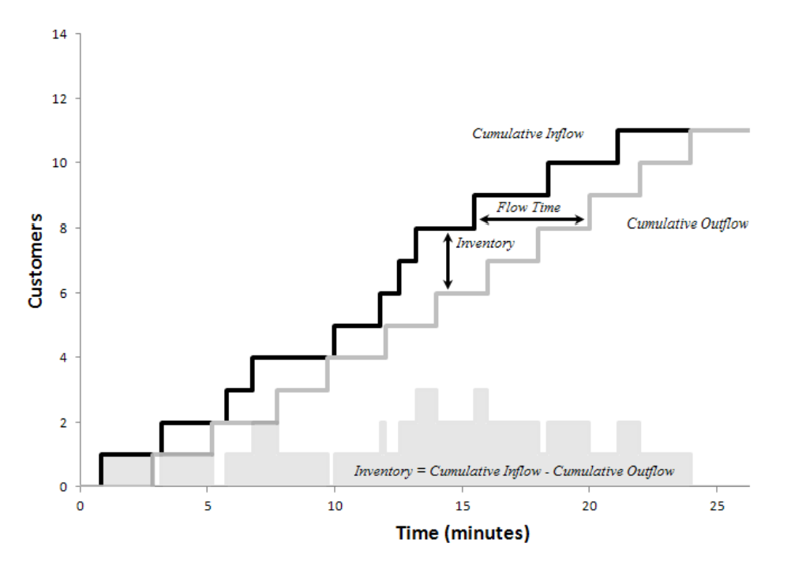

Draw a graph of Customers (y) vs Time (x)
- Cumulative Inflow = point when customer enters
- Cumulative Outflow = point when customer leaves
- **Inventory** = Vertical distance in (Cumulative Inflow - Cumulative Outflow)
- **Flow Time** = horizontal distance in (Time to serve the customer)

### The 3 Basic Measures

- *Flow rate / throughput*: number of flow units going through the process per
  unit of time
  - = (Customer/hour)
- *Flow Time*: time it takes a flow unit to go from the beginning to the end of
  the process
  - horizontal dist in 2 lines
- *Inventory*: the number of flow units in the process at a given moment in
  time
  - vertical dist in 2 lines
- *Flow Unit*: What we want to measure e.g. Customer or Sandwich

|       | Immigration department  | Champagne             |
| ----- | ----------------------- | --------------------- | 
| FU  = | Applications            | Bottle of champagne   |
| FT  = | Approved/rejected cases | Bottles sold per year |
| FT  = | Processing time         | Time in the cellar    |
| Inv = | Pending cases           | Content of cellar     |

|       | MBA Program      | Auto company   |
| ----- | ---------------- | -------------- |
| FU  = | Student          | Car            |
| FT  = | Graduating class | Sales per year |
| FT  = | 2 years          | 60 days        |
| Inv = | Total population | Inventory      |
 

### Quiz

Between the hours of noon and 1pm, 70 customers enter ACME pizza and 60 leave
with pies in hand. What is ACME's inventory of customers at 1pm assuming it was
zero at noon?
- 2
- 5
- 10
- 20

### Summary

**Inventory** = # flow units in system

**Flow rate** = # flow units going through the system

**Flow Time** = total time for flow unit to go from beginning to end

Inventory happens whenever there is a mismatch between supply and demand

## 02.02 Finding the Bottleneck

3 Steps
- Create a process flow diagram
- Find the bottleneck of the process and determine the maximum flow rate
- Conduct a basic process analysis 3. Conduct a basic process analysis

### Example Subway 

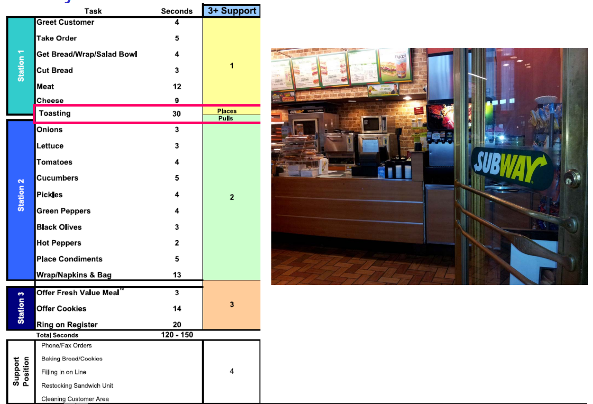

**Processing Times** = Unit of time / Flow Unit 
- e.g. Station 1 = 37 secs/customer
- e.g. Station 2 = 46 secs/customer
- same as **activity times**

Image above
- need 3 workers
- understand activities to make a sandwich
- can calculate total processing times

**Process Flow Diagram**

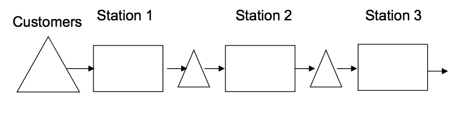

- arrow = flow of unit
- box = activity i.e. 37s/unit processing time for station 1
- triangle = flow unit waiting

### Basic Process Vocabulary

- **Processing times**: how long does the worker spend on the task?
  - i.e. 46 secs/cust * 3600 sec/hour = 78 customers / hour
- **Capacity** = 1/processing time: how many units can the worker make per unit
  of time
  - If there are m workers at the activity: Capacity=m/activity time
- **Bottleneck**: process step with the _lowest capacity_
- **Process capacity**: capacity of the bottleneck
- **Flow rate** = Minimum{Demand rate, Process Capacity)
- **Utilization** = Flow Rate / Capacity
- **Flow Time**: The amount of time it takes a flow unit to go through the process
- **Inventory**: The number of flow units in the system

### Example spreadsheet for Subway example above 

| Resource           | Station 1 | Station 2 | Station 3 | Units      |
| ------------------ | --------- | --------- | --------- | ---------- |
| Proc Time          | 37        | 46        | 37        | sec/unit   |
| Capacity (1/ProcT) | 0.027027  | 0.021739  | 0.027027  | units/sec  |
| Capacity/Hour      | 97.2973   | 78.26087  | 97.2973   | units/hour |
| Proc Capacity      |           |           |           |            |
| Demand             | 50        | 50        | 50        |            |
| Utilization        | 0.513889  | 0.638889  | 0.513889  |            |

### Quiz

The flow rate of a process is always less or equal to the capacity of the process
- true
- false
- It depnds on the number of resources
- Cannot be determined

### Summary

Introduced lots of vocabulary.

Allow to calculate flow rate without viewing process in action.

We can now predict the flow rate

## 02.03 Labor Cost and Labor Utilization 

### Review of Capacity Calculations

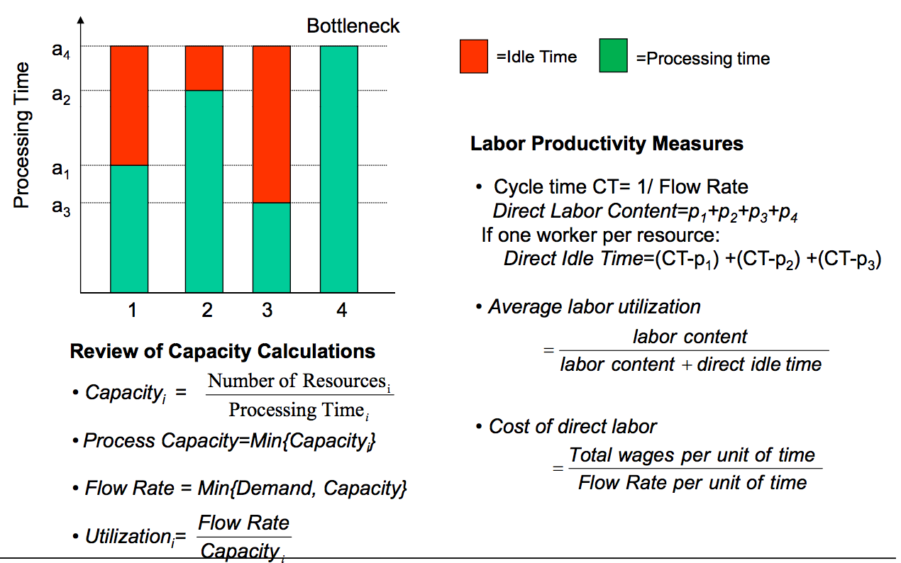

**Capacity** = 

    # Resources 
    ---------------
    Processing Time

**Process Capacity** = ``Min{Capacity}``

**Flow Rate** = `Min{Demand, Capacity}`

**Utiliziation** = 

    Flow Rate
    ---------
    Capacity

### Labor Productivity Measures

**Cycle time CT** = 

       1
    _________
    Flow Rate

**Direct Labor Content** = `p1 + p2 + p3 + p4` (total green in graph)

If one worker per resource:
**Direct Idle Time** = `(CT-p1) + (CT-p2) + (CT-p3)`

**Average labor utilization** = 

              labor content 
    ----------------------------------
    (labor content + direct idle time)

**Cost of direct labor** = 

    Total wages / time
    ------------------
    Flow rate   / time

### Example: Assembly Line with Six Stations

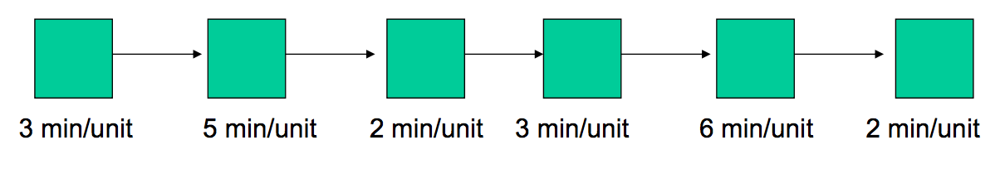

| Station         | 1   | 2   | 3   | 4   | 5   | 6   |  Measure  |
| --------------- | --- | --- | --- | --- | --- | --- | --------- |
| Processing Time | 3   | 5   | 2   | 3   | 6   | 2   |  min/unit |
| Capacity        | 0.3 | 1/5 | 1/2 | 1/3 | 1/6 | 1/2 |           |
| Proc Capacity   | 1/6 |     |     |     |     |     |           |
| Flow Rate       | 1/6 |     |     |     |     |     |           |
| Cycle Time      | 6   |     |     |     |     |     |           |
| Idle            | 3   | 1   | 4   | 3   | 0   | 4   |           |
| Total Idle Time | 15  | 1   | 4   | 3   | 0   | 4   |           |
| Labor content   | 21  |     |     |     |     |     |           |
| labor utilization | 0.58333
| Utilization     | 0.5 | 0.833 | 0.333 | 0.5 | 1 | 0.333 |
| Avg Utilization | 0.583333 

Assuming wages = $6/hr, Cost of Direct labor = (6 * 20) / 10 = $12/unit 

### Quiz

A process has four activities with processing times of 3, 2, 5, and 1 minutes per unit respectively. What is the direct labor content?

### Example from automative company

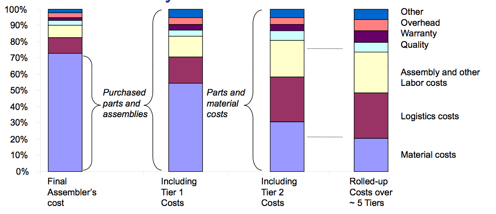

While labor costs appear small at first, they are important
- look relative to value added look relative to value added
- role up costs throughout the value chain

Implications
- also hunt for pennies (e.g. line balancing)
- spread operational excellence through the value chain

### Summary

2 measures: labor utilization vs labor cost 

Firms can hide labor by relying on suppliers (i.e. outsourcing). e.g. Apple outsourcing to FoxCon. Looks good on Apple's books due to lower labor cost passed on to FoxCon.

## Little’s Law

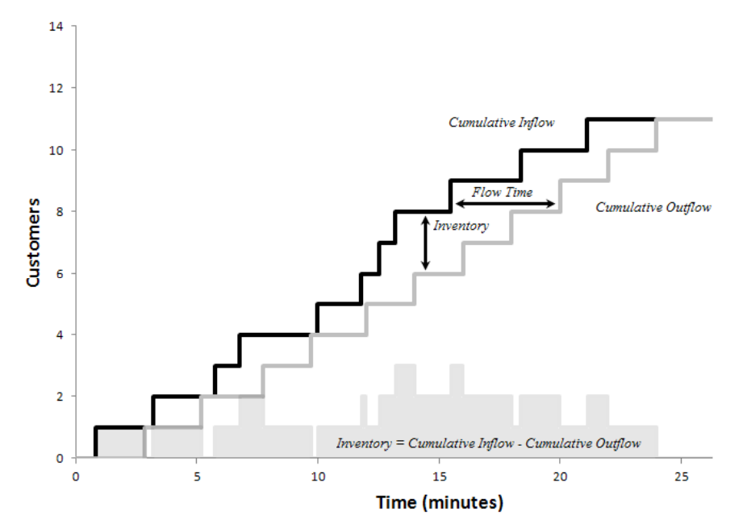

Inventory = Cumulative Inflow - Cumulative Outflow

*Little's Law*: Inventory (I) = Flow Rate (R) * Flow Time (T)

Implications:
- Out of the three fundamental performance measures (I,R,T), two can be chosen
by management, the other is GIVEN by nature
- Hold throughput constant: Reducing inventory = reducing flow time

Given two of the three measures, you can solve for the third:
- Indirect measurement of flow time: how long does it take you on average to respond to an email?
  - You write 60 email responses per day
  - You have 240 emails in your inbox

### Examples for Little's Law Appliations

In a large Philadelphia hospital, there are 10 births per day.
- 80% of the deliveries are easy and require mother and baby to stay for 2 days
- 20% of the cases are more complicated and require a 5 day stay

What is the average occupancy of the department?

### Little's law: Some remarks

- Not an empirical law
- Robust to variation, what happens inside the black box
- Deals with averages – variations around these averages will exist
- Holds for every time window
- Shown by Professor Little in 1961

## Inventory Turns / Inventory Costs

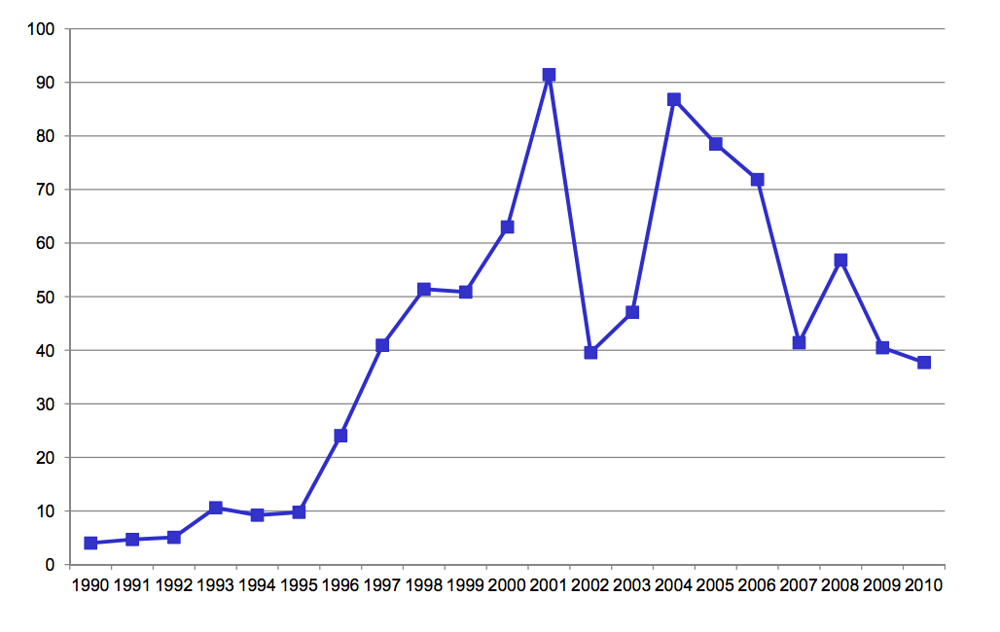

### Inventory Turns in Retailing and Its Link to Inventory Costs

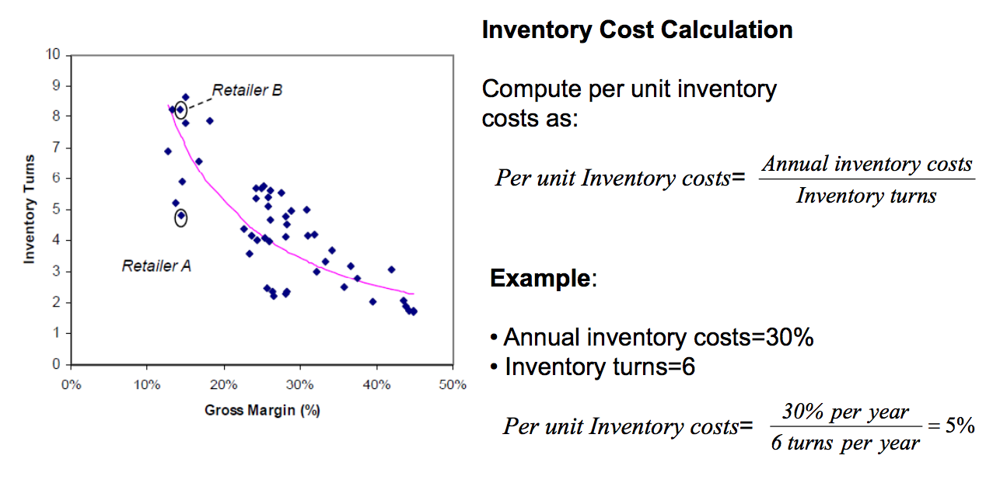

*Per Unit Inventory costs* = Annual inventory costs / Inventory turns

### Buffer or Suffer

Food Truck - Every five minutes:
- You get 0, 1, or 2 orders with equal probability
- You have a capacity of 0, 1, or 2 with equal probability
- It is not possible to make a sandwich before the order
- Customers are not willing to wait

=> How many sandwiches will you sell per five minute slot?

Variability will be a key factor in *waiting time*

    Scenario  Demand  Capacity
                                 
     A         0       0
     B         0       1
     C         0       2
                                 
     D         1       0
     E         1       1
     F         1       2
                                 
     G         2       0
     H         2       1
     I         2       2
   -------------------------- 
    Avg        1       1

Why variability does not always average itself out

Buffer-or-suffer strategy

Buffering is easier in production settings than in services (make to order vs
make to stock)
- Preview two different models: Queue and Newsvendor

### Difference Between Make-to-Order and Make-to-Stock

### Make to Stock vs Make to Order / Reasons for Inventory

McDonald's vs Subway

| McDonald’s (Make-to-Stock)             | Subway (Make-to-Order)          |   
| -------------------------------------- | ------------------------------- |
| 1. Make a batch of sandwiches          | 1. Customer orders              |
| 2. Sandwiches wait for customer orders | 2. Customer waits for sandwich  |
| 3. orders filled immediately           | 3. orders filled with delay     |
| => Sandwich waits for customer         | => Customer waits for sandwich  |           

Which approach is better? 

Make-to-Stock advantages include:
- Scale economies in production
- Rapid fulfillment (short flow time for customer order) 

Make-to-Order advantages include:
- Fresh preparation (flow time for the sandwich)
- Allows for more customization (you can hold all versions of a sandwich in stock)
- Produce exactly in the quantity demanded)

### Examples of Demand Waiting for Supply

Service Examples
- ER Wait Times: 58-year-old Michael Herrara of Dallas died of a heart attack
  after an estimated 19 hours in the local Hospital ER. Some ER’s now post
  expected wait times online / via Apps
- It takes typically 45 days do get approval on a mortgage; Strong link between
  wait times and conversion
- Waiting times for drive-through at McDonald's: 159 seconds; Long queues deter
  customers to join

Production Examples
- Buying an Apple computer
- Buying a Dell computer
  - => Make to-order vs Make-to-Stock

### Five Reasons for Inventory

*Pipeline inventory*: you will need some minimum inventory because of the flow time >0

*Seasonal inventory*: driven by seasonal variation in demand and constant capacity

*Cycle inventory*: economies of scale in production (purchasing drinks)

*Safety inventory*: buffer against demand (Mc Donald’s hamburgers)

*Decoupling inventory/ buffers*: buffers between several internal steps

## Multiple Flow Units

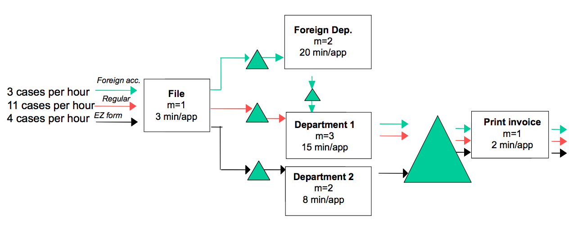
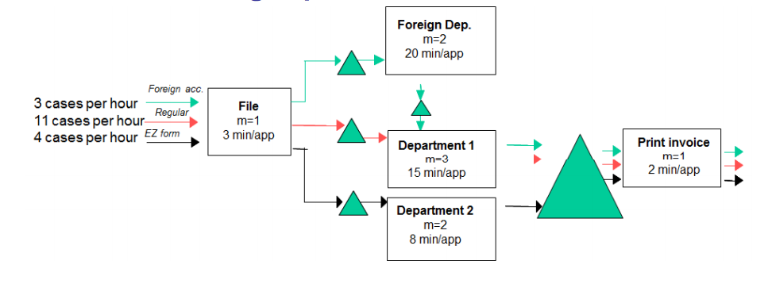
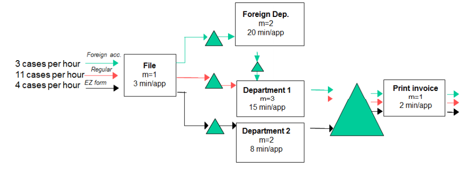

### Steps for Basic Process Analysis with Multiple Types of Flow Units

1. For each resource, compute the number of minutes that the resource can
   produce
2. Create a process flow diagram, indicating how the flow units go through the
   process the process
3. Create a table indicating how much workload each flow unit is consuming at
   each resource
4. Add up the workload of each resource across all flow units Add up the
   workload of each resource across all flow units.  
5. Compute the implied utilization of each resource as

*Implied utilization* = Step 3 / Step 1

The resource with the highest implied utilization is the bottleneck

Note: you can also find the bottleneck based on calculating capacity for each
step and then dividing the demand at this resource by the capacity

### Processes with Attrition Loss

Where is the Bottleneck?

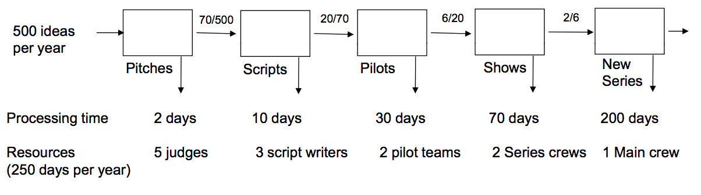

## Review of Process Analysis

